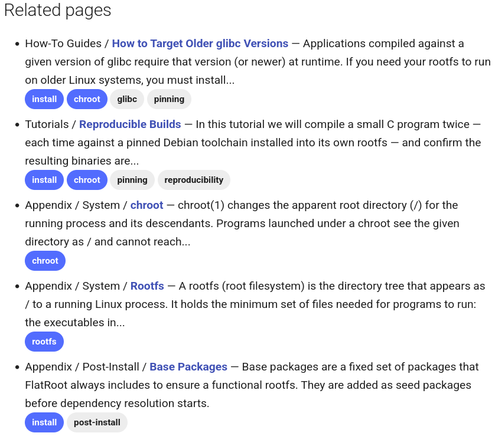

# Mkdocs Material Footer Tags

MkDocs plugin that injects a **Related pages** section into every tagged page at build time. Each entry shows the page's nav breadcrumb, the linked page title, a short description, and the page's tags as Material-styled pills. Tags shared with the current page are highlighted so the strongest matches are visible at a glance. Entries are ranked by Jaccard similarity of tag sets.

Designed to complement [Material for MkDocs](https://squidfunk.github.io/mkdocs-material/)'s built-in tags plugin: it reads the same `tags:` YAML frontmatter Material parses.

## Preview



## Install

```bash
pip install git+https://github.com/ruanformigoni/mkdocs-material-footer-tags.git@v0.1.0
```

## Use

Enable in `mkdocs.yml` alongside Material's tags plugin:

```yaml
plugins:
  - tags
  - mkdocs-material-footer-tags
```

Tag pages via YAML frontmatter:

```yaml
---
tags:
  - foo
  - bar
description: Optional override for the summary text in related-pages entries.
---

# My page

First paragraph is used as the summary when no `description:` is given.
```

The plugin injects a `## Related pages` section into each tagged page at build time, linking to up to 5 other pages ranked by tag similarity.

### Entry format

Each entry is emitted as:

```markdown
- Section / Subsection / **[Page Title](relative/path.md)** — Short description truncated...<br><a href="/tags/#tag:foo" class="md-tag md-tag--matched">foo</a> <a href="/tags/#tag:bar" class="md-tag">bar</a>
```

Components:

- **Breadcrumb** — the nav-section ancestors of the page (from `mkdocs.yml`), joined with ` / `, followed by the bold linked page title as the final component. Ancestor segments are plain text, the page title is the clickable element.
- **Description** — summary text, truncated at `summary_max_chars`.
- **Tag pills** — Material's `md-tag` class for consistent styling. Tags in common with the current page receive an extra `md-tag--matched` class. The plugin injects a tiny `<style>` block into each page's `<head>` so matched pills render in the theme's accent colour (`var(--md-accent-fg-color)`, falling back to `#448aff`) without the user adding CSS.
- **Tag index link** — if any page in the docs tree contains the `<!-- material/tags -->` marker (Material's tag-index landing), each pill links to `<tags-index>#tag:<name>`. Without that marker, pills render as non-clickable `<span>` elements with the same classes.

## Configuration

All options are optional.

```yaml
plugins:
  - mkdocs-material-footer-tags:
      max_pages: 5                # max entries in the list (default: 5)
      min_shared_tags: 1          # only include pages sharing at least this many tags (default: 1)
      heading: Related pages      # heading text (default: "Related pages")
      heading_level: 2            # heading depth, 1-6 (default: 2)
      show_summary: true          # include the per-entry description (default: true)
      show_tags: true             # include the tag-pill row (default: true)
      show_breadcrumb: true       # include the nav-path prefix (default: true)
      summary_max_chars: 180      # truncate summaries longer than this (default: 180)
      summary_ellipsis: "..."     # appended after truncation (default: "...")
```

## Summary source

For each entry, the plugin picks the summary from the first match in this chain:

1. YAML frontmatter `description:` field, if non-empty.
2. First body paragraph of the page — extracted after stripping the frontmatter and leading H1, skipping code blocks, block quotes, admonitions, lists, and heading lines.
3. No summary — the entry shows only breadcrumb and title.

Add `description:` to any page where the first-paragraph fallback produces a poor summary.

## Ranking

Pages are ranked by **Jaccard similarity**: `|A ∩ B| / |A ∪ B|` where `A` is the current page's tag set and `B` is the candidate page's tag set. Higher is better. Ties are broken alphabetically by title (case-insensitive), so output is byte-stable across builds. Pages with fewer than `min_shared_tags` overlap are excluded; at most `max_pages` entries are emitted.

Jaccard is preferred over raw overlap count because it rewards tight matches: a single-tag page that shares its one tag with you (Jaccard = 0.5 with a two-tag current page) ranks above a four-tag page that only shares one tag (Jaccard = 0.2).

## License

MIT.
